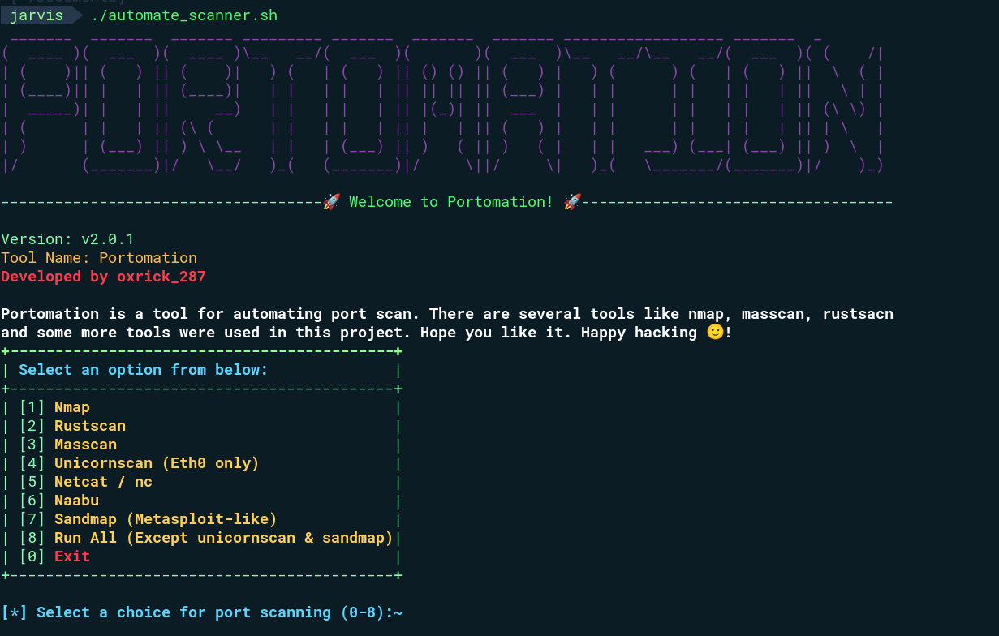
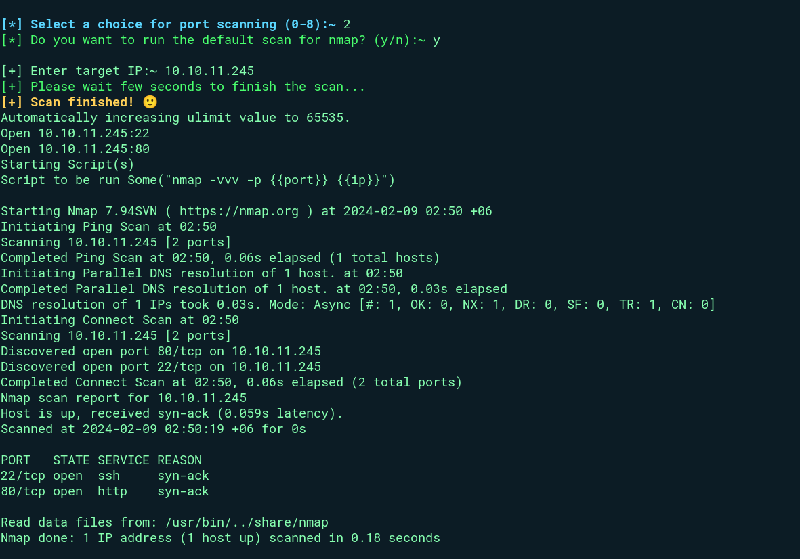
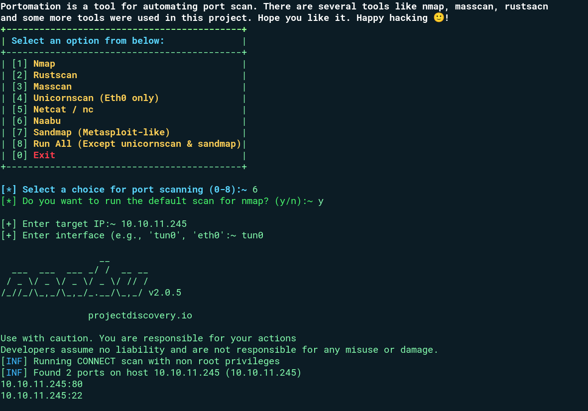

## Portomation

**Portomation is a tool for automating port scan. There are several tools like nmap, masscan, 
rustsacn and some more tools were used in this project. Hope you like it. Happy hacking 🙂!**

### Interface of the tool




### Examples
+ **Running Nmap**


+ **Running Naabu**


### Setup
```bash
git clone https://github.com/s0l4ris-211/Portomation-Automator-of-Port-Scan.git

cd Portomation-Automator-of-Port-Scan

chmod 777 portomation.sh

./portomation.sh
```

### Features
1. Multiple tools scanning method
2. Don't have the hassel to run every tool each time
3. Have multiple option for choice based on the user satifaction

### Limitations
Sometimes masscan can have issue with scanning port in real time doamin. Besides, ```bash Unicornscan & sandmap``` are not included in the run all option.

### Benefits
```typescript one can have their choice of flags or switch to run from the command line and don't need to go through every flag as it has default scanning mechanism```
